# アーキテクチャドキュメント

## 概要

このドキュメントは、動員ちゃれんじアプリケーションのアーキテクチャを記述しています。システム構成図、データフロー図、デプロイフロー図を含みます。

---

## システム構成図

### 全体構成

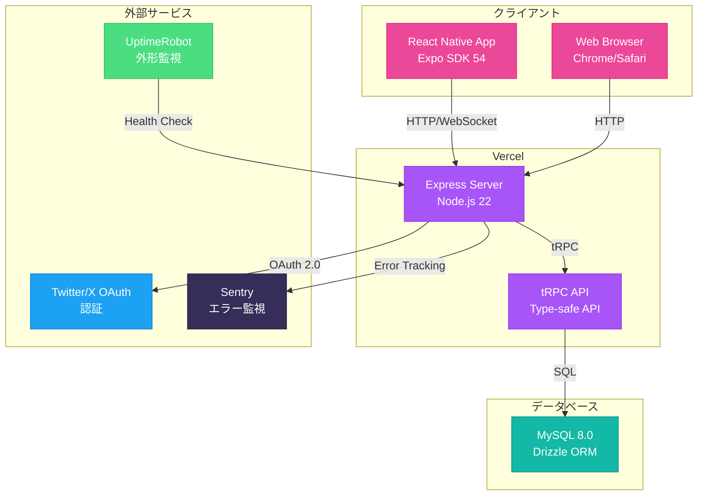

### 技術スタック

| レイヤー | 技術 | 説明 |
|---------|------|------|
| **フロントエンド** | React Native 0.81 | モバイルアプリ |
| | Expo SDK 54 | React Nativeフレームワーク |
| | NativeWind 4 | Tailwind CSS for React Native |
| | React 19 | UIライブラリ |
| **ルーティング** | Expo Router 6 | ファイルベースルーティング |
| **状態管理** | TanStack Query | サーバー状態管理 |
| | React Context | クライアント状態管理 |
| **API通信** | tRPC 11.7 | 型安全なAPI通信 |
| **バックエンド** | Express 4.22 | Webサーバー |
| | Node.js 22 | ランタイム |
| **データベース** | MySQL 8.0 | リレーショナルデータベース |
| | Drizzle ORM 0.44 | TypeScript ORM |
| **認証** | OAuth 2.0 | Twitter/X認証 |
| **監視** | Sentry | エラー監視 |
| | UptimeRobot | 外形監視 |
| **デプロイ** | Vercel | ホスティング |

---

## データフロー図

### 1. 認証フロー

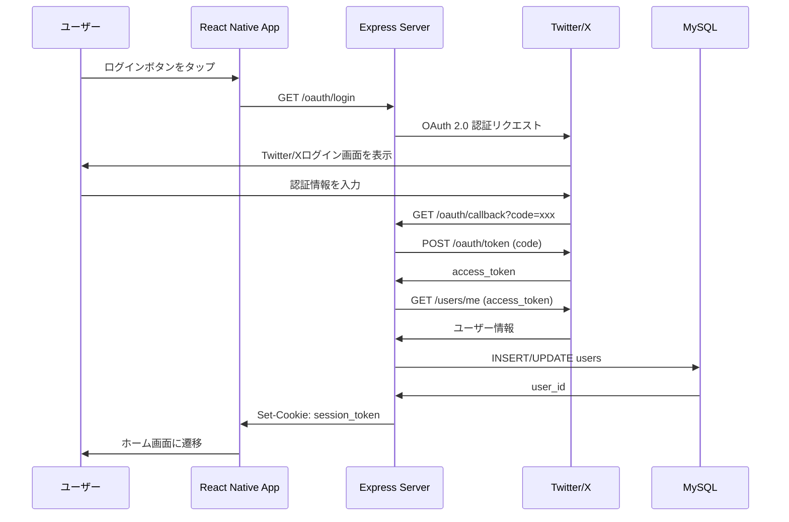

### 2. イベント作成フロー

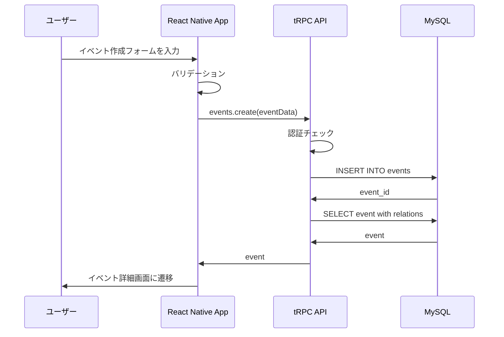

### 3. 参加表明フロー

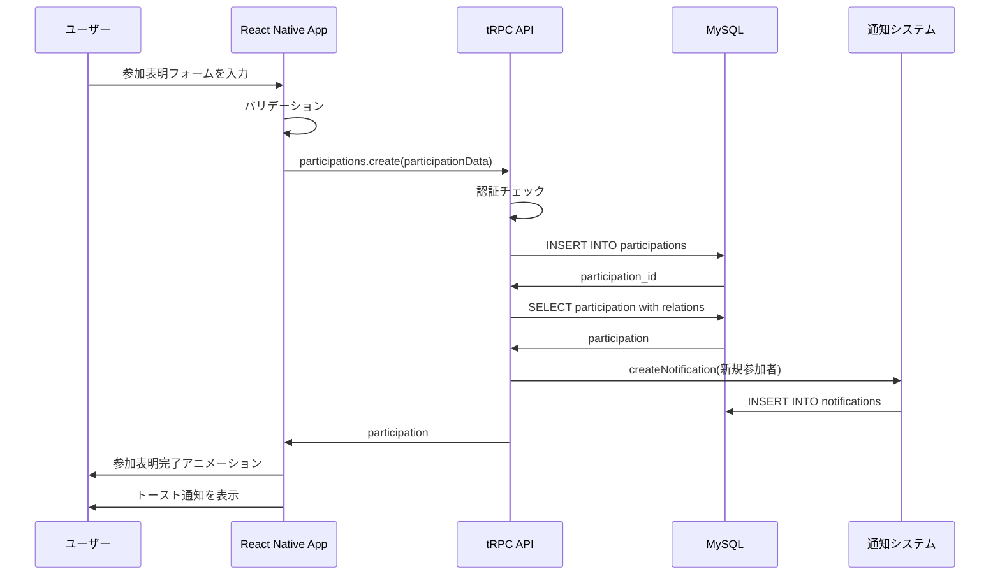

### 4. リアルタイム更新フロー

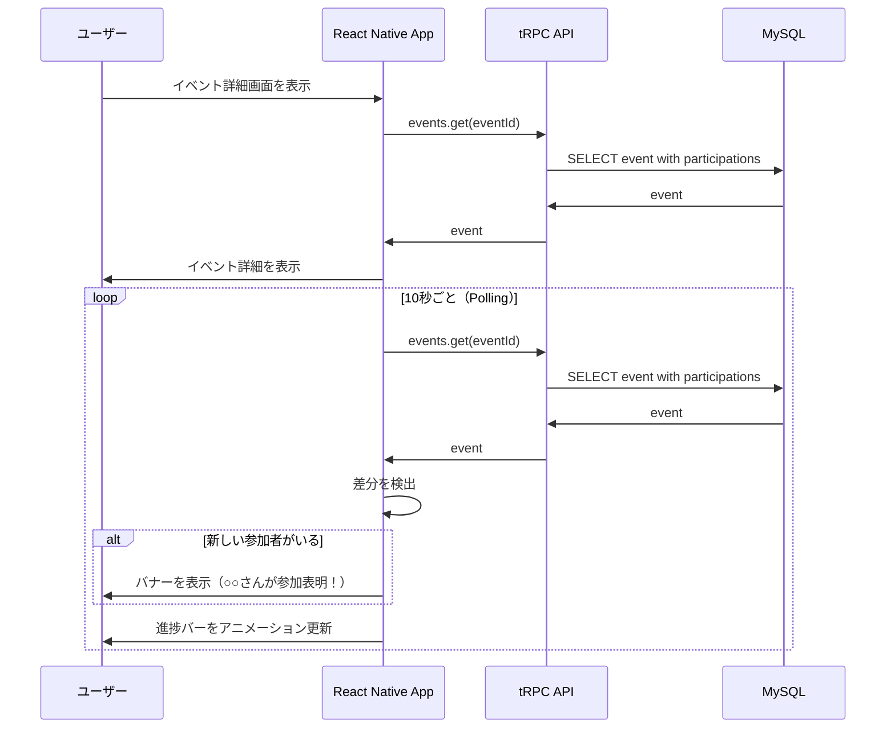

---

## デプロイフロー図

### CI/CDパイプライン

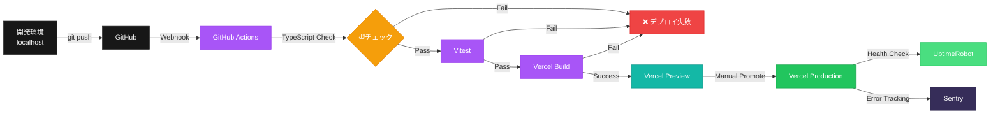

### デプロイ手順

#### 1. 開発環境

```bash
# 開発サーバーを起動
pnpm dev

# 型チェック
pnpm check

# テスト実行
pnpm test
```

#### 2. ステージング環境（Vercel Preview）

```bash
# GitHubにpush
git add .
git commit -m "feat: 新機能を追加"
git push origin main

# GitHub Actionsが自動実行
# - TypeScript型チェック
# - Vitestテスト
# - Vercelビルド

# Vercel Previewが自動デプロイ
# - プレビューURLが発行される
# - https://birthday-celebration-xxx.vercel.app
```

#### 3. 本番環境（Vercel Production）

```bash
# Vercelダッシュボードで「Promote to Production」をクリック
# または
vercel --prod

# 本番環境にデプロイ
# - https://doin-challenge.com

# 監視開始
# - UptimeRobot: /api/readyz を5分ごとに監視
# - Sentry: エラーを自動収集
```

---

## データベーススキーマ

### ER図

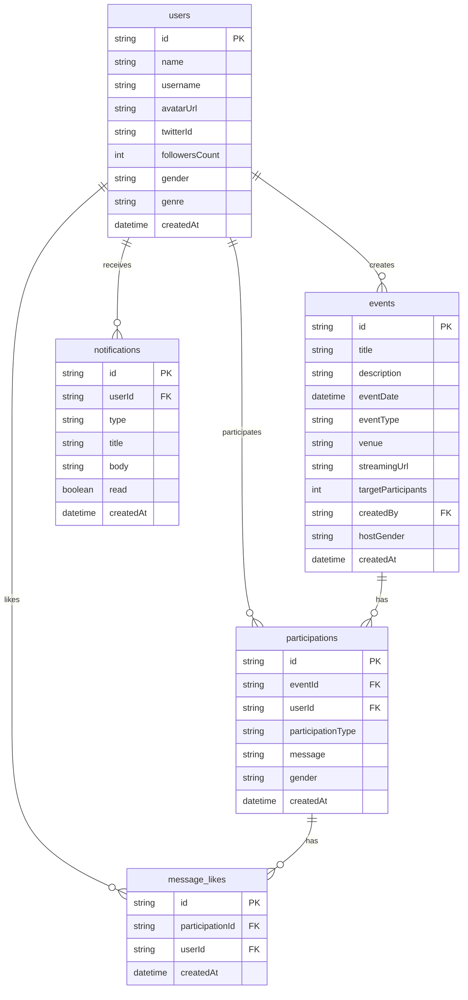

### 主要テーブル

| テーブル | 説明 | 主要カラム |
|---------|------|-----------|
| **users** | ユーザー情報 | id, name, username, twitterId, followersCount, gender, genre |
| **events** | イベント情報 | id, title, description, eventDate, targetParticipants, hostGender |
| **participations** | 参加表明 | id, eventId, userId, participationType, message, gender |
| **notifications** | 通知 | id, userId, type, title, body, read |
| **message_likes** | 応援メッセージへの「いいね」 | id, participationId, userId |

---

## セキュリティ

### 認証・認可

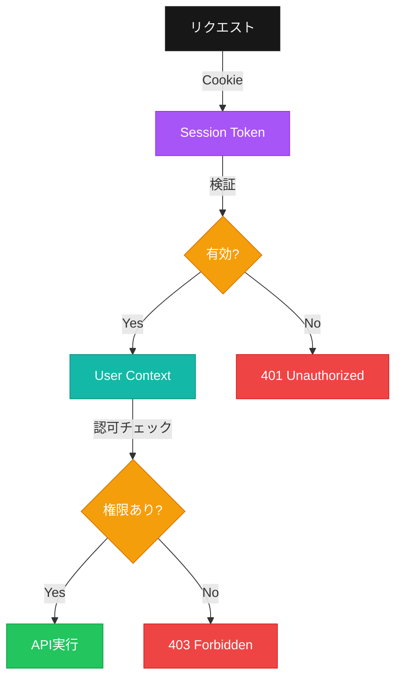

### セキュリティ対策

| 対策 | 実装 |
|------|------|
| **認証** | OAuth 2.0（Twitter/X） |
| **セッション管理** | HTTPOnly Cookie |
| **CSRF対策** | SameSite Cookie |
| **XSS対策** | React自動エスケープ |
| **SQLインジェクション対策** | Drizzle ORMのパラメータ化クエリ |
| **レート制限** | 未実装（将来的に追加予定） |

---

## パフォーマンス最適化

### フロントエンド

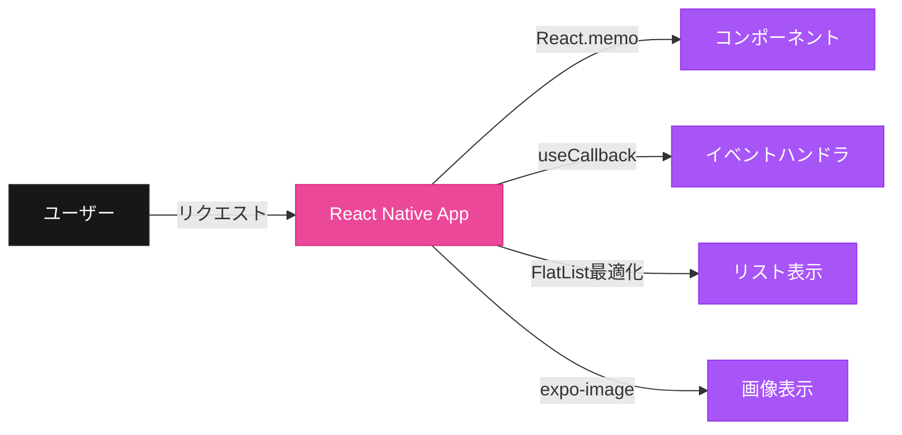

### バックエンド

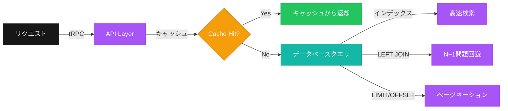

---

## 監視・運用

### 監視フロー

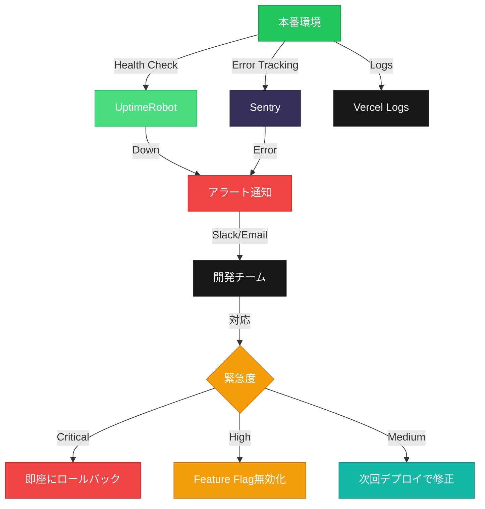

### 監視項目

| 項目 | ツール | 閾値 | アラート |
|------|--------|------|---------|
| **サーバー稼働率** | UptimeRobot | 99.9% | Slack/Email |
| **エラー率** | Sentry | 5xx > 1% | Slack/Email |
| **ログイン失敗率** | Sentry | > 10% | Slack/Email |
| **レスポンスタイム** | Vercel | > 3秒 | Dashboard |
| **メモリ使用量** | Vercel | > 80% | Dashboard |

---

## 変更履歴

| バージョン | 日付 | 変更内容 |
|-----------|------|---------|
| v1.0.0 | 2026-01-27 | 初版作成 |

---

## サポート

アーキテクチャに関する質問や提案がある場合は、[GitHub Issues](https://github.com/kimito-link/doin-challenge.com/issues)で報告してください。
