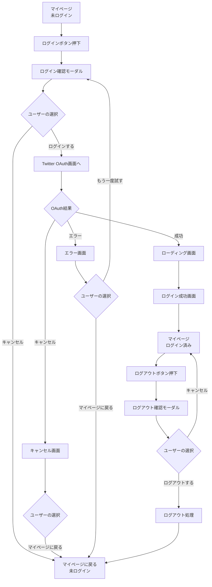
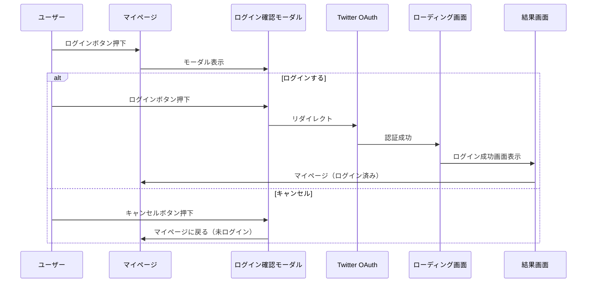
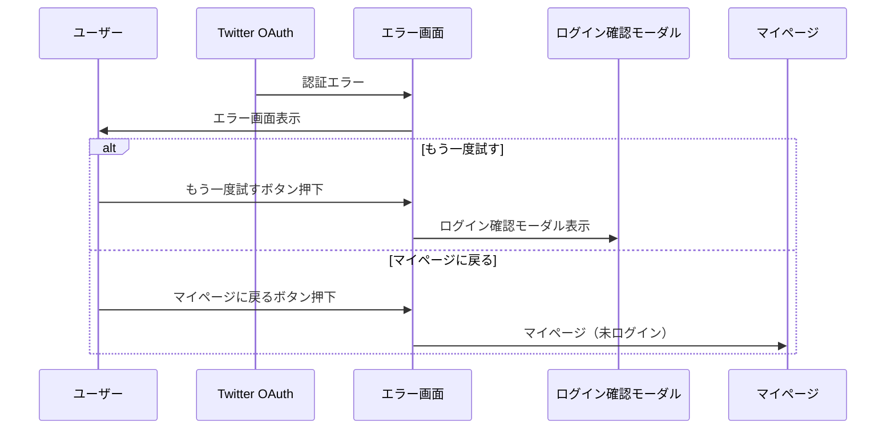
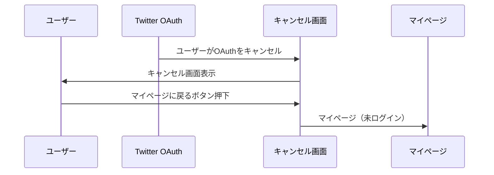
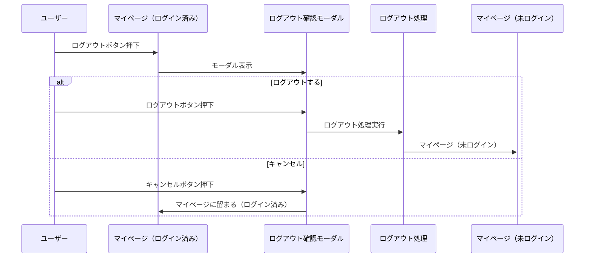

# Phase 2 遷移図

## 全体フロー



---

## 詳細フロー

### 1. ログインフロー



### 2. エラーフロー



### 3. キャンセルフロー



### 4. ログアウトフロー



---

## 画面一覧

### 既存画面（Phase 1）
1. **マイページ（未ログイン）**
   - ログインボタン表示
   - ファイル: `app/(tabs)/mypage.tsx`

2. **ログイン確認モーダル**
   - ログインのメリット表示
   - 「ログインする」「キャンセル」ボタン
   - ファイル: `components/organisms/login-confirm-modal.tsx`

3. **マイページ（ログイン済み）**
   - ユーザー情報表示
   - ログアウトボタン表示
   - ファイル: `app/(tabs)/mypage.tsx`

### 新規画面（Phase 2）

4. **ローディング画面**
   - りんくキャラクターのアニメーション
   - 「ログイン中...」メッセージ
   - ファイル: `components/organisms/link-auth-loading.tsx`（新規作成）

5. **結果画面（共通コンポーネント）**
   - 成功/キャンセル/エラーを出し分け
   - ファイル: `components/organisms/link-auth-result.tsx`（新規作成）
   - Props:
     - `type: 'success' | 'cancel' | 'error'`
     - `errorType?: 'network' | 'oauth' | 'other'`（エラー時のみ）
     - `requestId?: string`（エラー時、開発環境のみ）

6. **ログアウト確認モーダル**
   - ログアウトの影響を説明
   - 「ログアウトする」「キャンセル」ボタン
   - ファイル: `components/organisms/logout-confirm-modal.tsx`（新規作成）

---

## 状態管理

### ログイン状態

```typescript
type AuthState = 
  | { status: 'unauthenticated' }
  | { status: 'loading' }
  | { status: 'authenticated', user: User }
  | { status: 'error', error: AuthError };
```

### エラー種別

```typescript
type AuthError = 
  | { type: 'network', message: string }
  | { type: 'oauth', message: string }
  | { type: 'other', message: string, requestId?: string };
```

---

## URL パラメータ

### OAuth コールバック

```
/oauth/callback?code=xxx&state=yyy
```

### エラー時

```
/oauth/callback?error=access_denied&error_description=xxx
```

### キャンセル時

```
/oauth/callback?cancelled=true
```

---

## 実装の優先順位

1. **キャンセル画面**（最優先）
   - ユーザーが戻るボタンを押した時の対応
   - `LinkAuthResult` コンポーネント作成
   - `type='cancel'` の実装

2. **エラー画面**
   - `LinkAuthResult` に `type='error'` を追加
   - エラー種別の判定ロジック
   - requestId の表示（開発環境のみ）

3. **ローディング画面**
   - `LinkAuthLoading` コンポーネント作成
   - りんくキャラクターのアニメーション

4. **ログアウト確認**
   - `LogoutConfirmModal` コンポーネント作成
   - ログアウトボタンの動作変更

---

## 遷移のルール

### 基本ルール
1. **マイページ起点**
   - すべてのログイン関連フローはマイページから開始
   - エラー/キャンセル後はマイページ（未ログイン）に戻る

2. **モーダルの使い分け**
   - 確認: モーダル
   - 結果: フルスクリーン画面

3. **戻るボタンの動作**
   - モーダル: 閉じる
   - フルスクリーン: マイページに戻る

### エラー時の遷移
1. **もう一度試す**
   - ログイン確認モーダルを再表示
   - Twitter OAuth に再度リダイレクト

2. **マイページに戻る**
   - マイページ（未ログイン）に遷移
   - エラー状態をクリア

### キャンセル時の遷移
1. **マイページに戻る**
   - マイページ（未ログイン）に遷移
   - キャンセル状態をクリア

---

## 実装時の注意事項

1. **状態の永続化**
   - ログイン状態は AsyncStorage に保存
   - アプリ再起動後も維持

2. **エラーハンドリング**
   - すべてのエラーをキャッチ
   - ユーザーに優しいメッセージを表示
   - 開発環境では詳細情報を表示

3. **ローディング状態**
   - 最小表示時間: 500ms
   - 最大表示時間: 10秒（タイムアウト）

4. **アニメーション**
   - モーダルの開閉: 300ms
   - 画面遷移: 250ms
   - ローディング: 無限ループ

5. **アクセシビリティ**
   - すべてのボタンに適切なラベル
   - スクリーンリーダー対応
   - キーボードナビゲーション対応（Web）
