# Phase 2実装ガイド: ログインUX改善

## 目次

1. [思想（Why）](#思想why)
2. [前提（Assumptions）](#前提assumptions)
3. [ポリシー（Rules）](#ポリシーrules)
4. [状態遷移（FSM）](#状態遷移fsm)
5. [UIコンポーネント設計](#uiコンポーネント設計)
6. [実装手順（1PR=1状態）](#実装手順1pr1状態)
7. [テスト戦略](#テスト戦略)
8. [NG集（触ってはいけないファイル）](#ng集触ってはいけないファイル)
9. [レスポンシブデザインチェック](#レスポンシブデザインチェック)

---

## 思想（Why）

### 目的

ログインが必要な場面で、ユーザーが**迷わず・怖がらず・戻ってこれる**体験を作る。

### 増やしたい幸せ

- **"押していいボタン"が一目で分かる**
  - ログインボタンの位置・文言・導線を統一
  - 二重導線（トップとメニュー）を解消
- **外部（X公式）に飛ぶ前後で不安にならない**
  - 事前に「Xの画面に移動する」と説明
  - 戻ってきたら自動で続きに進むことを保証
- **キャンセル/失敗しても「次に何をすればいいか」が明確**
  - 「もう一度ログイン」「ログインせず戻る」の2択を提示
  - エラー詳細は出しすぎない（不安を増やさない）

### 捨てるもの

- **技術的に正しいけどユーザーに伝わらない文言**
  - ❌ 「認証」「OAuth」「コールバック」
  - ✅ 「ログイン」「Xの画面に移動」「戻ってくる」
- **"賢そうに見せるための複雑さ"**
  - エラー詳細の出し過ぎ
  - 技術用語の露出
- **1回の実装で全部完成させようとする完璧主義**
  - 1PR=1状態で段階的に実装
  - 壊れにくい順に実装

---

## 前提（Assumptions）

### ログインは外部遷移が必須

- X公式の画面に移動する
- アプリ内で完結しない
- 戻ってくるまでの時間は不定

### login()は黒箱

```typescript
login(returnUrl?, forceSwitch?) => Promise<void>
```

- **成功/失敗は戻り値で判定できない**
- **成否は「アプリ側のセッション状態（Auth Context）変化」で検知する**
- **Phase 2では引数をいじらない**（安全のため）

### OAuthコールバックは壊すと即死

- **触らない**
- 触るなら別フェーズ・別PR・別テスト体制

### 二重導線が混乱を生む

- トップとメニューに「Xでログイン」が2つある
- どちらを使うべきか分からない
- **Phase 2で統一する**

---

## ポリシー（Rules）

### P0（絶対に守る）

- **OAuthコールバック・サーバ認証経路に触れない**
  - Phase 2ではUIラップのみ
- **ログイン開始は"必ずユーザーの明示タップ"でのみ**
  - 自動login禁止
- **画面状態は有限状態機械（FSM）で管理**
  - idle → confirm → redirecting → waitingReturn → success/cancel/error

### P1（強く推奨）

- **キャンセル/失敗は必ず「次の一手」を出す**
  - 「もう一度ログイン」「ログインせず戻る」
- **文言はログイン基調、絵文字禁止、りんくの吹き出しで統一**

### P2（できれば）

- **危険変更をCIで検知**
  - `app/oauth/**`, `server/twitter*`, `hooks/use-auth.ts` などに触れたら fail/要承認

---

## 状態遷移（FSM）

### Mermaid図

```mermaid
stateDiagram-v2
  [*] --> idle

  idle --> confirm: tapLogin (requiresConfirm=true)
  idle --> redirecting: tapLogin (requiresConfirm=false)

  confirm --> redirecting: confirmYes
  confirm --> idle: confirmNo

  redirecting --> waitingReturn: call login(); app goes background / navigation change
  redirecting --> error: immediateThrow (rare) / unexpected

  waitingReturn --> success: auth.isLoggedIn == true
  waitingReturn --> error: auth.error != null
  waitingReturn --> cancel: returnedToApp && timeoutReached && !isLoggedIn && !error
  waitingReturn --> cancel: userTap("戻る/キャンセル")  (optional UI)

  success --> idle: autoClose (e.g. 800ms) or tapContinue
  cancel --> confirm: tapRetry
  cancel --> idle: tapBackWithoutLogin
  error --> confirm: tapRetry
  error --> idle: tapBackWithoutLogin
```



### 状態ごとの詳細

#### idle

- **表示**: 既存画面（トップ/メニュー）＋ログインボタン
- **遷移**:
  - `tapLogin` → confirm（確認を挟む方針なら）
  - `tapLogin` → redirecting（確認なし方針なら）
- **やること**: 何もしない（自動login禁止）

#### confirm

- **表示**: ログイン確認モーダル（りんく吹き出し）
  - 文言例: 「Xの画面に移動してログインするよ。戻ってきたら自動で続きに進むよ。」
  - ボタン: 「Xでログインする」「やめる」
- **遷移**:
  - confirmYes → redirecting
  - confirmNo → idle
- **やること**: ここでだけ "ユーザー明示タップ" を満たす

#### redirecting

- **表示**: ローディング画面（短時間）
  - 文言例: 「Xを開いているよ…」
- **遷移**:
  - `login()`呼び出し後、Appが背景化/外部遷移した想定で `waitingReturn` へ
  - `login()`が同期的に例外投げたら `error`
- **やること**:
  - `login(returnUrl?)` を呼ぶ（**Phase2では引数をいじらない**のが安全）

#### waitingReturn

- **表示**: 戻り待ち画面
  - 文言例: 「Xでの操作が終わったら、このアプリに戻ってきてね」
  - サブ: 「戻ってきたら自動で続きに進むよ」
  - 操作: 「キャンセル」「もう一度」
- **遷移条件（成否検知）**:
  - success: `auth.isLoggedIn === true`
  - error: `auth.error !== null`
  - cancel: **(戻ってきた + 一定時間) AND 未ログイン AND エラーなし**
- **キャンセル判定タイミング**:
  - **戻ってきた起点**でタイマー開始（例: 20秒）
  - 戻ってきた判定: RNなら `AppState` が `active` になった瞬間
  - 20秒経っても `isLoggedIn`/`error` が変化しない → cancel

#### success

- **表示**: 成功画面（短い）
  - 文言例: 「ログインできたよ。続きに進むね。」
  - ボタン: 「続きへ」（自動遷移でもOK）
- **遷移**: idle（または元画面に戻す）

#### cancel

- **表示**: キャンセル画面
  - 文言例: 「ログインが完了していないみたい。もう一度やる？」
  - ボタン: 「もう一度ログイン」「ログインせず戻る」
- **遷移**:
  - retry → confirm
  - back → idle

#### error

- **表示**: エラー画面
  - 文言例: 「うまくログインできなかったよ。もう一度やる？」
  - エラー詳細は出しすぎない（P1）
- **遷移**:
  - retry → confirm
  - back → idle

---

## UIコンポーネント設計

### TypeScript型定義

```typescript
export type AuthUxState =
  | { name: "idle" }
  | { name: "confirm"; reason: "need_login" | "switch_account" }
  | { name: "redirecting" }
  | { name: "waitingReturn"; startedAt: number; timeoutMs: number }
  | { name: "success" }
  | { name: "cancel"; kind: "timeout" | "user" }
  | { name: "error"; message?: string };

export type LinkSpeechTone = "normal" | "warning";

export type LinkSpeechProps = {
  title?: string;          // 例: "りんく"
  message: string;         // 吹き出し本文（短い）
  tone?: LinkSpeechTone;
};

export type LinkAuthLoadingProps = {
  message: string;
  subMessage?: string;
};

export type LinkAuthResultVariant = "success" | "cancel" | "error";

export type LinkAuthResultProps = {
  variant: LinkAuthResultVariant;
  title: string;
  message: string;
  primaryLabel: string;        // 例: "もう一度ログイン"
  onPrimary: () => void;
  secondaryLabel?: string;     // 例: "ログインせず戻る"
  onSecondary?: () => void;
};

export type LoginConfirmModalProps = {
  open: boolean;
  speech: LinkSpeechProps;
  confirmLabel: string; // "Xでログインする"
  cancelLabel: string;  // "やめる"
  onConfirm: () => void;
  onCancel: () => void;
  busy?: boolean;
};
```

### 「どの状態で何を表示するか」（マッピング）

- **idle**: 既存画面（トップ/メニュー）
- **confirm**: `LoginConfirmModal`（内部で `LinkSpeech` 使用）
- **redirecting**: `LinkAuthLoading`（全画面 or モーダル）
- **waitingReturn**: `LinkAuthLoading`（説明 + キャンセルボタン付き版）
- **success/cancel/error**: `LinkAuthResult`

### 既存コンポーネントとの関係

- **LogoutConfirmModalの"型"は流用可**（モーダルの土台/Overlay）
- ただし文言・状態管理は別：
  - Logout: 破壊的操作の確認
  - Login: 外部遷移の不安解消
- 依存方向:
  - `LoginConfirmModal` は `LogoutConfirmModal` を import してもOK
  - 逆はNG（循環しがち）

---

## 実装手順（1PR=1状態）

### 実装順序（壊れにくい順）

1. **PR-1: FSMの器だけ**（idle/confirmだけ、login呼ばない）
2. **PR-2: redirecting**（login呼ぶが、waitingReturnは"ただの画面"でOK）
3. **PR-3: waitingReturn + 成否検知**（Auth Context監視・AppState復帰・タイムアウト）
4. **PR-4: cancel画面**（retry/back導線）
5. **PR-5: error画面**（auth.error表示を「短文」に整形）
6. **PR-6: success画面 + 自動close**（短い演出）
7. **PR-7: 二重導線整理**（トップ/メニューのログイン導線を「1つの入口」に統一）

> **重要**: OAuth callback周りはPhase2では一切触らないので、PRの粒度をUIに閉じ込める。

### PRマージ前の必須チェック

**Phase 2のPRをマージする前に、以下を必ず確認してください：**

1. **Vercel Production の Commit SHA と GitHub main の HEAD が一致していること**
   - Vercel Deploymentsページで現在のProductionのコミットハッシュを確認
   - GitHub mainの最新コミットハッシュと比較
   - 一致していない場合は、原因を調査してから進める

2. **本番環境でログイン機能が正常動作していること**
   - PC/スマホでTwitterログインをテスト
   - ログイン→ログアウト→再ログインの一連の流れを確認

3. **diff-check CIが通過していること**
   - 危険ファイル（OAuth/auth関連）に触れていないこと
   - 禁止ワードが差分に含まれていないこと

これにより、「ローカルは直ってるのに本番は壊れてる」「戻したのに戻ってない」といった事故を防ぎます。

### 各PRのタスクリスト

#### PR-1（confirmのみ）

- [ ] `auth-ux` 用の `useAuthUxMachine()` を追加（UIディレクトリ配下）
- [ ] confirmモーダル実装（LinkSpeechで文言統一）
- [ ] ボタンタップで state が confirm↔idle することを確認
- **テスト**:
  - unit: reducer（状態遷移）だけ
  - 手動: モーダルが開閉する
- **レスポンシブチェック**: モーダルが全画面サイズで正しく表示される

**コミット例**: `feat(auth-ux): add confirm modal state machine (no login call)`

#### PR-2（redirecting）

- [ ] confirmYesで `redirecting` に遷移
- [ ] `redirecting` で `login()` を呼ぶ（try/catchで例外はerrorへ）
- [ ] 画面表示（loading）
- **テスト**:
  - 手動: ボタン→ローディング→外部遷移が起きる（戻って来るまでは気にしない）
- **レスポンシブチェック**: ローディング画面が全画面サイズで正しく表示される

**コミット例**: `feat(auth-ux): call login() and show redirecting loading`

#### PR-3（waitingReturn検知）

- [ ] AppState active復帰を検知
- [ ] active復帰で `waitingReturn` に入り `timeoutMs=20000`
- [ ] `auth.isLoggedIn` で success, `auth.error` で error
- [ ] timeoutで cancel
- **テスト**:
  - 手動: Xに飛ぶ→戻る→成功/失敗/放置でcancel
  - unit: タイマー開始条件（active復帰）とtimeout遷移
- **レスポンシブチェック**: 戻り待ち画面が全画面サイズで正しく表示される

**コミット例**: `feat(auth-ux): waitingReturn with AppState+timeout and auth context detection`

#### PR-4/5/6（結果画面）

- cancel/result/error/successを追加して導線整備
- successは短時間で自動close（800msなど）
- **レスポンシブチェック**: 各結果画面が全画面サイズで正しく表示される

**コミット例**:
- `feat(auth-ux): add cancel result screen with retry/back`
- `feat(auth-ux): add error result screen (friendly copy)`
- `feat(auth-ux): add success screen and auto close`

#### PR-7（二重導線整理）

- [ ] ログイン入口を `LoginEntry` に集約（同じコンポーネントを使う）
- [ ] トップ/メニュー双方で同じ入口を使い、文言揺れをなくす
- **レスポンシブチェック**: ログイン入口が全画面サイズで正しく表示される

**コミット例**: `refactor(auth-ux): unify login entry points to reduce duplicated UX`

---

## テスト戦略

### 手動「1分儀式」（毎PR必須）

**目的**: 本番即死経路（OAuth）を触ってないことと、UXが迷子にならないことの確認

1. アプリ起動（トップ表示）
2. 「Xでログイン」→ confirm表示（文言OK / ボタン2つ）
3. 「Xでログインする」→ ローディング表示 → Xへ遷移
4. すぐ戻る（端末の戻る/アプリ切替）
5. waitingReturnが表示される
6. 20秒待つ（未ログインなら cancel になる）
7. cancel画面で「ログインせず戻る」→ 元の画面に戻る
8. もう一度ログイン→成功したら success→遷移

※ 成功ルートは毎回やると重いので、PR-3以降は「成功 or cancelのどちらかは必ず確認」でOK

### diff-check（CIで危険変更検知）

#### 監視対象（触ったら fail/要承認）

- `app/oauth/**`
- `server/twitter*`
- `hooks/use-auth.ts`
- `lib/auth-provider.tsx`
- `app/**/oauth*`（似た命名も）
- `middleware*` / `api/**auth**`（もしあるなら）

#### 禁止ワード（PR差分に含まれたら要承認）

- `callback`
- `oauth`
- `pkce`
- `code_verifier`
- `redirect_uri`
- `state=`
- `token`
- `twitter-callback`

> Phase2は「UIラップだけ」なので、これに引っかかった時点で"別フェーズ"。

### E2Eテストは必要か？

Phase2では **必須ではない**（コスト大・外部Xが絡む）

代わりに：
- unit: FSM reducer（状態遷移）
- 手動1分儀式
- diff-check（危険変更ブロック）

（ただし将来、Playwrightで「ログインボタン→confirm→戻る→cancel」までの**疑似E2E**は価値あり。Xログイン自体はモック）

---

## NG集（触ってはいけないファイル）

### Phase 2で触らない（P0）

- `app/oauth/**`
- `server/twitter*`
- `hooks/use-auth.ts`（loginの実装）
- `lib/auth-provider.tsx`（Auth Contextの定義・更新ロジック）
- OAuth callback画面/ルート（`twitter-callback.tsx` 等）

### 追加で"基本触らない"推奨（事故が多い）

- `vercel.json`（ビルド/ルーティング事故）
- `middleware.*`（ルーティング事故）
- `app/_layout.*` やルートナビ（戻り導線が壊れやすい）
- 認証に絡む `api/*` ルート

### 「触らずに改善する」具体策

触るのは **UI層だけ**

- `components/auth-ux/*`
- `hooks/use-auth-ux-machine.ts`（新規）
- `screens/LoginUxGate.tsx`（新規）

`login()` は呼ぶだけ（引数もいじらないのが安全）

成否判定は `AuthContext` の **読取のみ**

外部遷移の不安を減らすのは **文言と画面**で解決（技術ではない）

---

## レスポンシブデザインチェック

### 目的

どのウィンドウサイズでもUI/UXが正しく表示されることを保証する。

### チェック項目

#### 各PR共通

- [ ] **モバイル（375px）**: 全要素が正しく表示される
- [ ] **タブレット（768px）**: 全要素が正しく表示される
- [ ] **デスクトップ（1024px以上）**: 全要素が正しく表示される
- [ ] **テキストの折り返し**: 長い文言が正しく折り返される
- [ ] **ボタンのタップ領域**: 最小44x44pxを確保
- [ ] **モーダルの中央配置**: 画面中央に正しく配置される
- [ ] **スクロール**: 縦長コンテンツが正しくスクロールできる

#### 画面別チェック

##### confirm（ログイン確認モーダル）

- [ ] モーダルが画面中央に表示される
- [ ] りんくの吹き出しが正しく表示される
- [ ] ボタンが2つ並んで表示される（縦並び推奨）
- [ ] 文言が折り返されても読みやすい

##### redirecting（ローディング画面）

- [ ] ローディングインジケーターが画面中央に表示される
- [ ] 文言が画面中央に表示される

##### waitingReturn（戻り待ち画面）

- [ ] 文言が画面中央に表示される
- [ ] ボタンが画面下部に表示される
- [ ] 長い文言が折り返されても読みやすい

##### success/cancel/error（結果画面）

- [ ] アイコンが画面上部に表示される
- [ ] 文言が画面中央に表示される
- [ ] ボタンが画面下部に表示される（2つある場合は縦並び推奨）

### テスト方法

#### ブラウザDevTools

1. Chrome DevToolsを開く（F12）
2. デバイスツールバーを表示（Ctrl+Shift+M）
3. 以下のプリセットでテスト：
   - iPhone SE（375x667）
   - iPad（768x1024）
   - Desktop（1920x1080）
4. カスタムサイズでテスト：
   - 320px（最小）
   - 1440px（大画面）

#### 実機テスト

- iOS（iPhone）
- Android（Pixel）
- タブレット（iPad / Android Tablet）

### チェックリスト（PR作成時）

```markdown
## レスポンシブデザインチェック

- [ ] モバイル（375px）で正しく表示される
- [ ] タブレット（768px）で正しく表示される
- [ ] デスクトップ（1024px以上）で正しく表示される
- [ ] テキストが正しく折り返される
- [ ] ボタンのタップ領域が44x44px以上
- [ ] モーダルが画面中央に配置される
- [ ] スクロールが正しく動作する
```

---

## まとめ

Phase 2実装ガイドは以下の原則に基づいています：

- **思想**: 迷わない／怖がらない／戻ってこれる
- **前提**: login黒箱、成否はAuth Context、外部遷移必須
- **ポリシー**: OAuth触らない、自動login禁止、FSM管理、次の一手必須、文言統一
- **実装**: 1PR=1状態、壊れにくい順、手動1分儀式、diff-check、レスポンシブチェック

このガイドに従うことで、**本番障害を起こさずに**ログインUXを改善できます。
